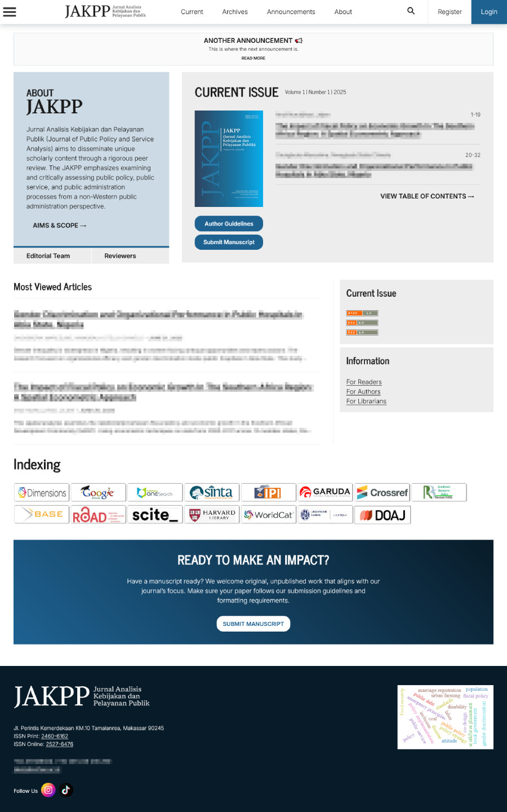

# Sahadeva Theme FREE

**Created by Janisa Pascawati and Andi Nuruljihad**

Named after the youngest Pandava brother, this theme is designed to be elegant, thoughtful, and powerful beneath the surface, with responsive design, clean layout, and customizable structure that supports scholarly publishing with clarity and precision.

**This is the free version of the Sahadeva theme, which is powered by ads.**

Purchase a license to remove all ads **forever**. Contact us at [hello(at)komkom.id](mailto:hello@komkom.id).

## Installation

1. Download the .tar.gz release.
2. Extract or upload it to the plugins/themes/ directory of your OJS installation.
3. Enable the theme from Website Settings → Appearance → Themes.

## Notes

This version is a stable starting point for journals looking for a sleek, modern look.

Future versions will include additional customization, block options, and plugin integration.

**Full Changelog**: https://github.com/Bocah5Racun/sahadeva-theme/commits/v1.0.0.0
